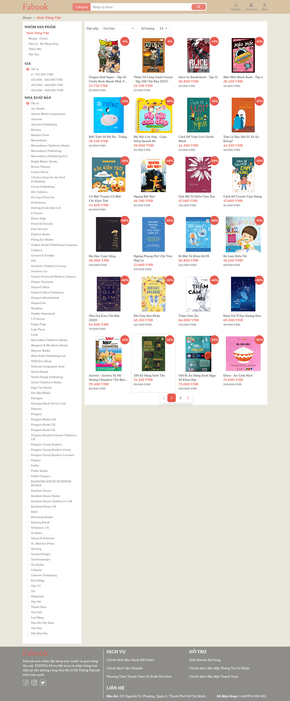
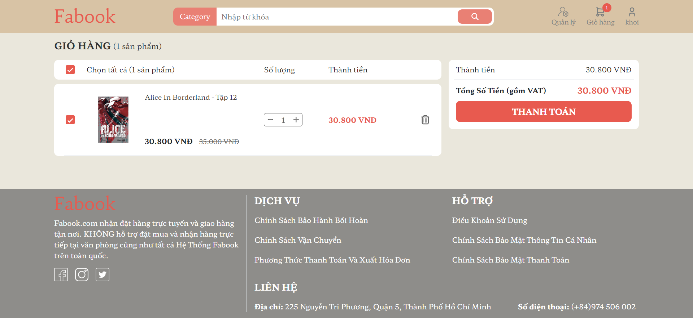

# Fabook

## Introduction
This is a selling books website. Fabook is a MPA using MVC model with:
- Express.js to to handle server-side logic, routing, and middleware
- Handlebars template engine to build up the front-end
- Microsoft SQL Server database to store data

## Features
The website satisfies basic features of an ECommerce website including:
- Sign up account
- Login account
- Login account with Google
- View product list with sort, filter and full-text search
- View product detail
- Add product to cart
- Add shipping information
- Checkout
- Buy now
- Admin features
- Upload user avatar
- See statistics

## Gallery

  

  Category page

  

  Cart page

## Video demo

  

## Tech stack

  
  

  
  

## Contribution
The project belongs to Fabook members:
- [Trần Quang Minh](https://github.com/qminhtran)
- [Trần Hoàng](https://github.com/Sczars)
- [Trần Nguyễn Minh Khôi](https://github.com/Minh-Kop)
- [Nguyễn Tuấn Kiệt](https://github.com/TuanKiet297)

**Please do not copy without asking for permission!**
